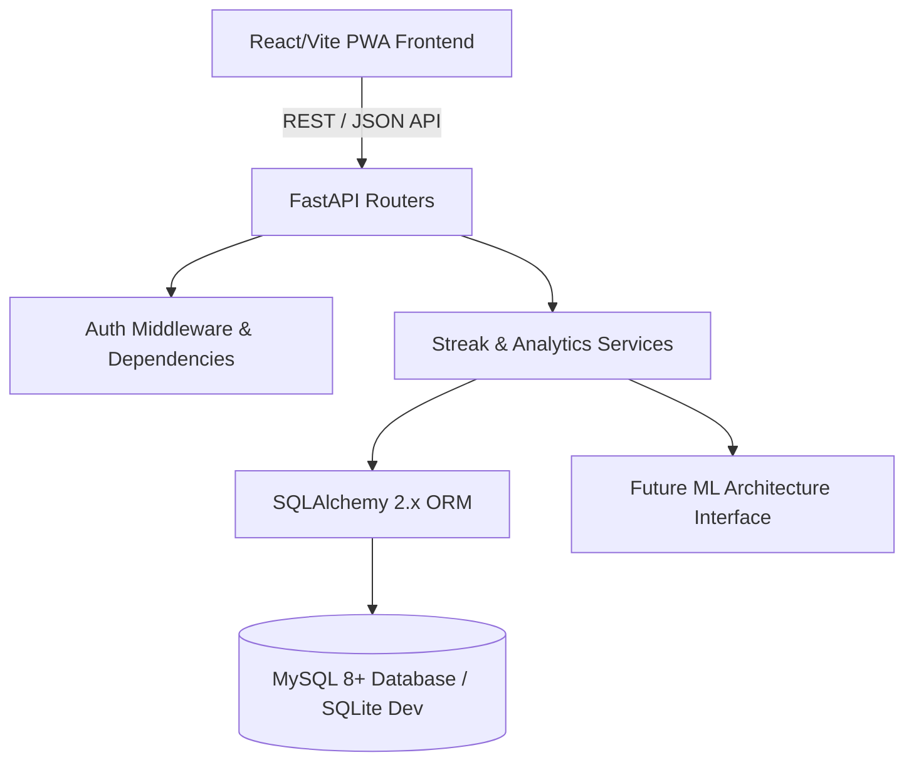

# HabitFlow Architecture Overview

HabitFlow is structured following **Clean Architecture** principles, separating concerns into decoupled layers for maximum scalability, testability, and maintainability.

## Frontend Architecture (`frontend/src/`)
- **Components (`components/`)**: Reusable UI components (HabitCard, ProgressRing, StatCard, Calendar, Heatmap, Modals).
- **Pages (`pages/`)**: Top-level route views (DashboardPage, HabitsPage, CalendarPage, StatisticsPage, ProfilePage, SettingsPage).
- **Layouts (`layouts/`)**: Responsive shell with Navbar, Sidebar, and MobileBottomNav.
- **Contexts (`context/`)**: AuthContext for JWT management & ThemeContext for light/dark mode.
- **Services (`services/api.ts`)**: Centralized Axios HTTP client with request/response interceptors.

## Backend Architecture (`backend/app/`)
- **`core/`**: Central configuration, database engines, security (Bcrypt password hashing & JWT generation).
- **`models/`**: SQLAlchemy ORM models (`User`, `Category`, `Habit`, `HabitCompletion`, `Notification`).
- **`schemas/`**: Pydantic v2 schemas for request validation & OpenAPI response models.
- **`routers/`**: RESTful API route endpoints (`auth`, `habits`, `dashboard`, `statistics`, `calendar`, `insights`, `categories`).
- **`services/`**: Core business domain logic (`StreakService` & `AnalyticsService`).
- **`ml/`**: Architecture interface stubs for future predictive ML pipelines.
- **`tests/`**: Pytest automated unit and integration tests.
