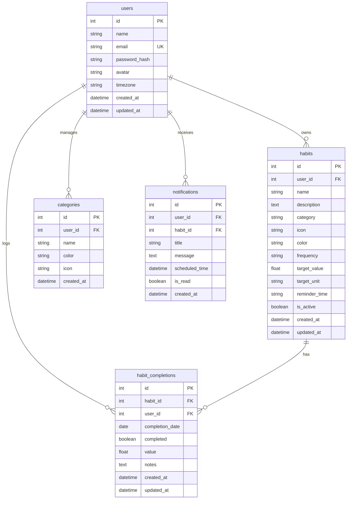

# HabitFlow Database Schema (MySQL 8+)

## Constraints & Indexes
1. `habit_completions`: Unique constraint `uq_habit_completion_date (habit_id, completion_date)` prevents duplicate completion records.
2. `users.email`: Indexed and strictly unique.
3. Foreign keys with `ON DELETE CASCADE` ensure clean cleanup when deleting habits or user accounts.
